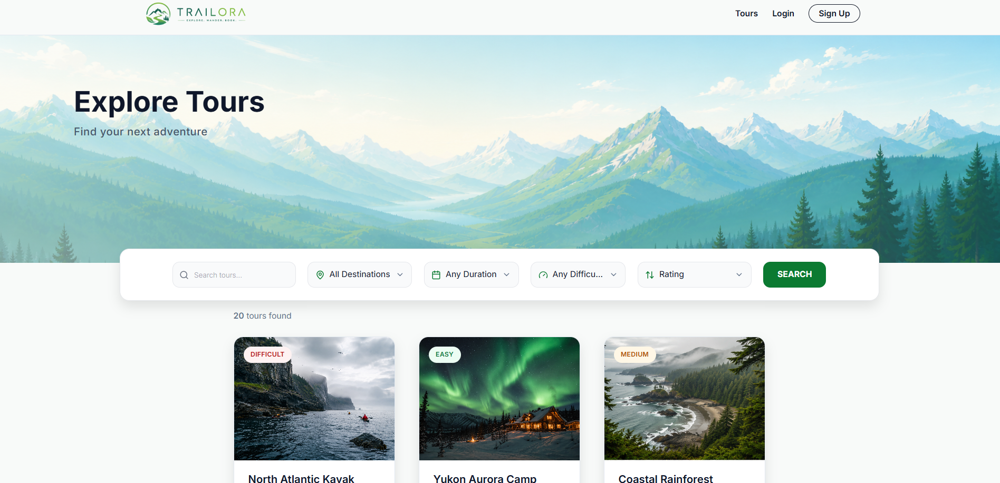
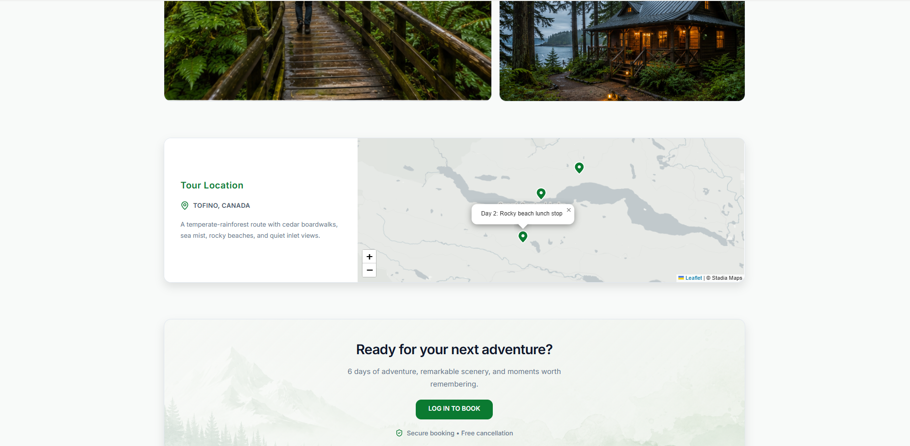
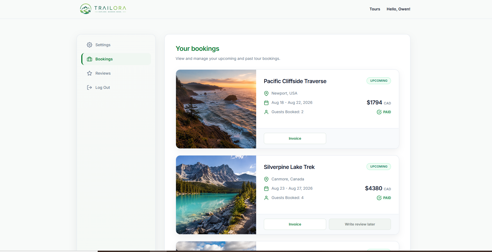

# Trailora Frontend

**Trailora** is a production travel-booking platform that I independently designed, built, and deployed end-to-end. This repository contains the responsive React frontend.

**Live:** https://trailora.armita.dev  
**Backend:** https://github.com/armita1988/trailora-backend

## Product Preview



<table>
  <tr>
    <td width="50%">
      
    </td>
    <td width="50%">
      
    </td>
  </tr>
  <tr>
    <td align="center"><sub>Interactive tour locations with Leaflet</sub></td>
    <td align="center"><sub>Authenticated booking management experience</sub></td>
  </tr>
</table>

## Highlights

- Built the complete responsive UI for desktop, tablet, and mobile with React and Tailwind CSS
- Implemented tour discovery, search, filtering, sorting, detailed tour views, and interactive Leaflet maps
- Built signup, login, logout, session restoration, profile, password-update, and password-recovery flows
- Added protected, guest-only, nested, and dynamic routing with React Router
- Managed shared application state with Context API, `useReducer`, React hooks, and reusable custom hooks
- Integrated booking/payment flows with the Trailora API and Stripe Checkout
- Added booking/account experiences and downloadable PDF invoices
- Automated production delivery to Amazon S3 and CloudFront with GitHub Actions and AWS OIDC

## Tech Stack

**Core:** React 19, Vite, Tailwind CSS, React Router  
**State & UI:** Context API, `useReducer`, React Hooks, Custom Hooks  
**Maps & Documents:** Leaflet / React Leaflet, html2pdf.js  
**Delivery:** GitHub Actions, Amazon S3, CloudFront, AWS IAM/OIDC

## Architecture

```text
React UI
   ↓
Routing + Context / Hooks
   ↓
Trailora REST API
   ↓
Authentication, bookings, payments, and account workflows
```

The frontend is organized around reusable components, page-level views, global contexts, and shared utilities rather than tightly coupling data and UI logic.

## Production CI/CD

Pushes to `main` run a GitHub Actions pipeline that:

```text
Install dependencies → Lint → Build with Vite
→ Authenticate to AWS with OIDC
→ Sync build to S3
→ Invalidate CloudFront
```

The workflow uses short-lived AWS credentials through OIDC instead of static AWS access keys stored in the repository.

## Run Locally

```bash
git clone https://github.com/armita1988/trailora-frontend.git
cd trailora-frontend
npm install
npm run dev
```

Configure the frontend API environment variables before starting the development server.
